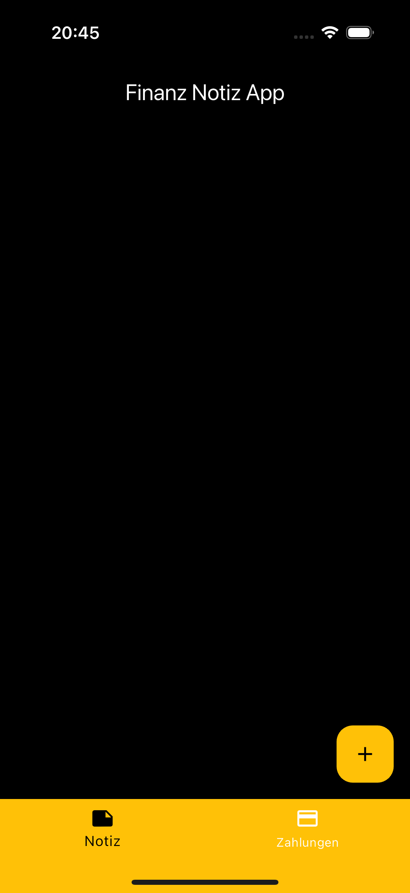
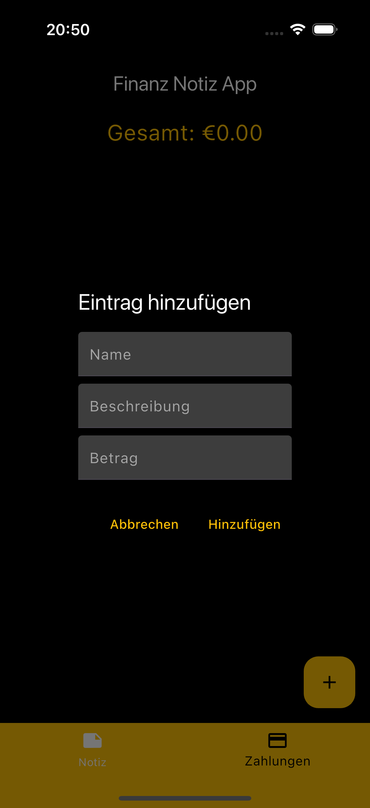
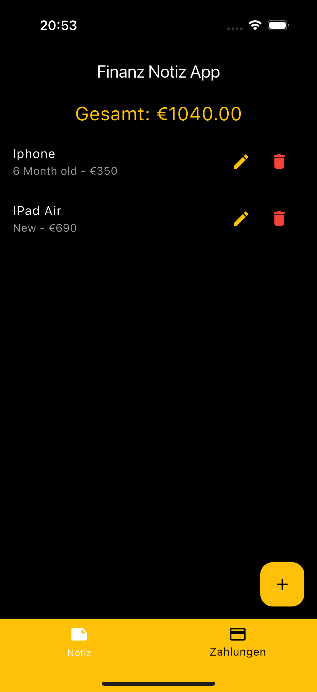

# finanz_notiz_app

My first App

This is one of my first apps, developed as a newcomer to the programming world. In the future, I aim to work in a more structured and efficient way. As a beginner, it was easier for me to write all the code in the main.dart file.

The app is a simple note-taking application that allows users to create notes and add payments with descriptions and amounts.

I will continue to gradually improve and expand on this first app.

